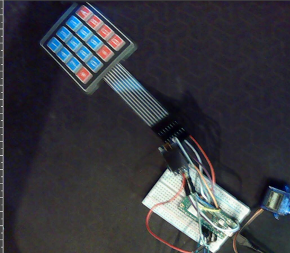
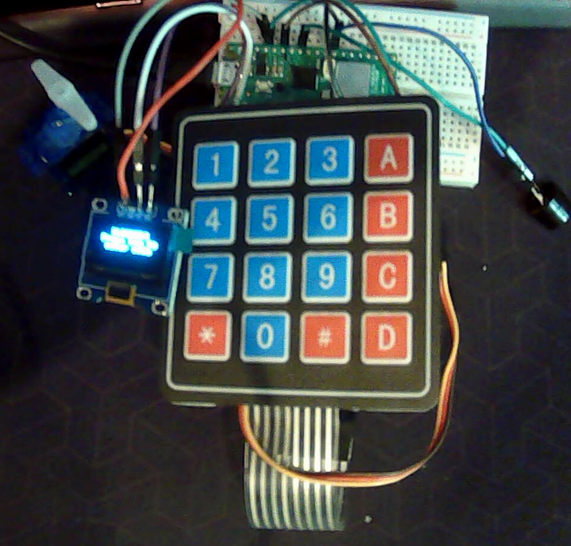
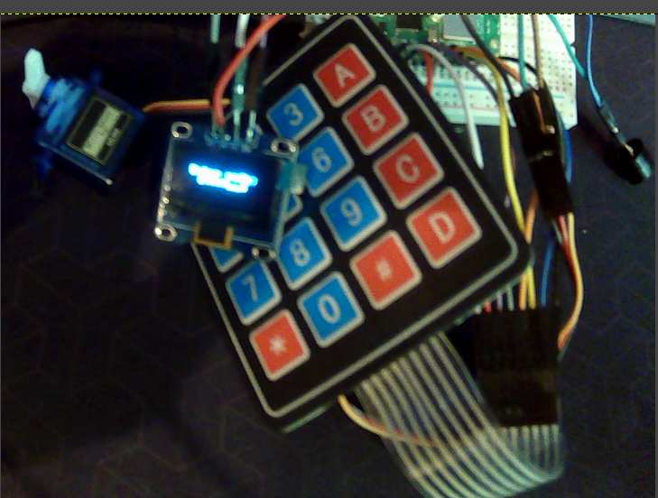

This repository has the pictures of me assembling [the PicoLock project I made a few weeks ago](https://github.com/JubilantMarmot/HC-TheBin).

### Here

 - First time assembling it just to get it to work

 - Cleaned up version lock screen

 - Cleaned up version entering code screen
